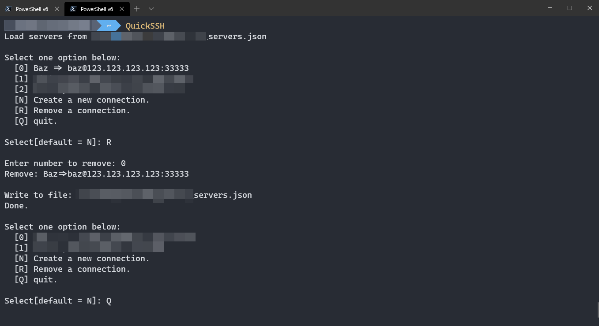
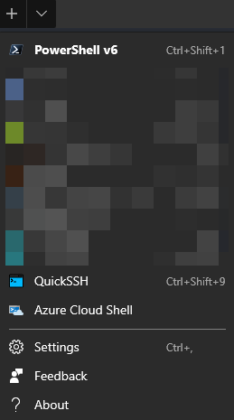
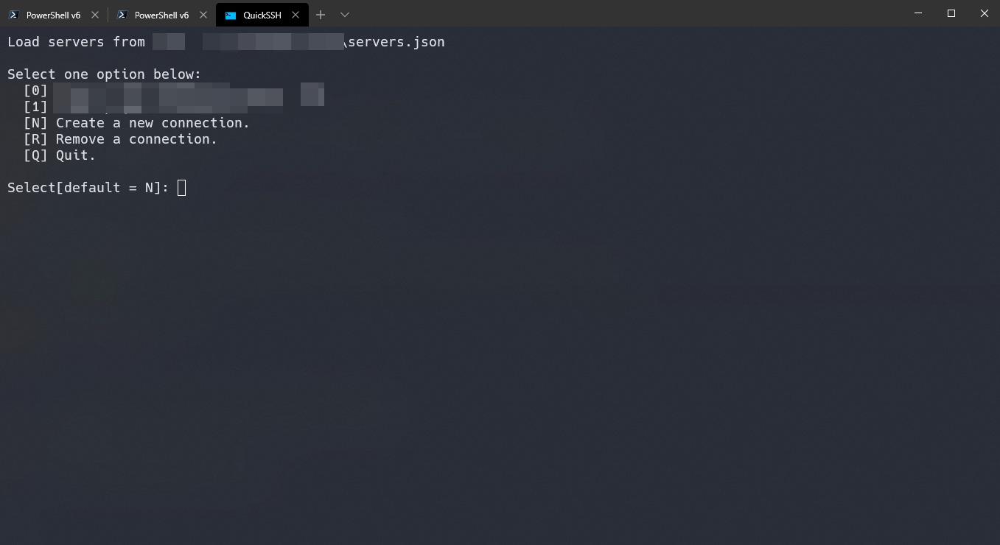

# QuickSSH

Just for fun. Maintain the SSH servers list in a JSON file, and use command `QuickSSH` to select one to connect.

## Usage

Download [QuickSSH.ps1](https://raw.githubusercontent.com/Pagliacii/QuickSSH/master/QuickSSH.ps1) to somewhere you like, and add this function below into your `$PROFILE`:

```powershell
Function QuickSSH { Invoke-Expression "\path\to\QuickSSH.ps1" }
# Helpful functions
Function KillAgent { gpg-connect-agent killagent /bye }
Function RunAgent { gpg-connect-agent /bye }
```

Reopen your powershell and enter `QuickSSH`, it will work correctly!

1. Connect

```shell
PS > QuickSSH
Load servers from /path/to/servers.json

Select one option below:
  [0] foo => foo@111.111.111.111:11111
  [1] bar => bar@222.222.222.222:22222
  [N] Create a new connection.
  [R] Remove a connection.
  [Q] Quit.

Select[default = N]: 0

Write to file: /path/to/servers.json
Done.

Connect to foo@111.111.111.111:11111
Touch your smark key to auth when its light was blink:
```

2. Add a new connection

```shell
PS > QuickSSH
Load servers from /path/to/servers.json

Select one option below:
  [0] foo => foo@111.111.111.111:11111
  [1] bar => bar@222.222.222.222:22222
  [N] Create a new connection.
  [R] Remove a connection.
  [Q] Quit.

Select[default = N]:

Please fill the fields of new connection:
> Name of connection: Baz
> Username: baz
> Hostname: 123.123.123.123
> Port[default = 22]: 33333
> New Connection: Baz=>baz@123.123.123.123:33333

Write to file: /path/to/servers.json
Done.

Connect to baz@123.123.123.123:33333
Touch your smart key to auth when its light was blink:
ssh: connect to host 123.123.123.123 port 33333: Connection refused
```

3. Remove a connection and quit

```shell
PS > QuickSSH
Load servers from /path/to/servers.json

Select one option below:
  [0] Baz => baz@123.123.123.123:33333
  [1] foo => foo@111.111.111.111:11111
  [2] bar => bar@222.222.222.222:22222
  [N] Create a new connection.
  [R] Remove a connection.
  [Q] Quit.

Select[default = N]: R

Enter number to remove: 0
Remove: Baz=>baz@123.123.123.123:33333

Write to file: /path/to/servers.json
Done.

Select one option below:
  [0] foo => foo@111.111.111.111:11111
  [1] bar => bar@222.222.222.222:22222
  [N] Create a new connection.
  [R] Remove a connection.
  [Q] quit.

Select[default = N]: Q

See you.
```

## Test Environment

| Entry    | Value                                                                                                                             |
| -------- | --------------------------------------------------------------------------------------------------------------------------------- |
| OS       | Windows 10                                                                                                                        |
| Shell    | Powershell(v6.2.1) + [oh-my-posh](https://github.com/JanDeDobbeleer/oh-my-posh) + [posh-git](https://github.com/dahlbyk/posh-git) |
| Terminal | [Microsoft Terminal](https://github.com/microsoft/terminal)                                                                       |
| Others   | [Gpg4win](https://www.gpg4win.org/) + [Cygwin/SSH](https://www.cygwin.com/)                                                       |

## Integration with Microsoft Terminal

Add code below into `profiles.json > [ ] profiles`:

```json
        {
            "acrylicOpacity": 0.8,
            "closeOnExit": true,
            "colorScheme": "One Half Dark",
            "commandline": "pwsh -File path-to-QuickSSH.ps1",
            "cursorColor": "#FFFFFF",
            "cursorShape": "emptyBox",
            "fontFace": "Hack NF",
            "fontSize": 14,
            "guid": "{Custom GUID}",
            "historySize": 9001,
            "icon": "path-to-icon-file",
            "name": "QuickSSH",
            "padding": "10, 10, 10, 10",
            "snapOnInput": true,
            "useAcrylic": true
        },
```

## Screenshots







## Note

1. If you don't use the smart key to auth, comment these lines in the script:

```powershell
Function ConnectBySSH {
    ...
    # Comment >> Println "Touch your smart key to auth when its light was blink: "
    ...
}
Function Main {
    ...
    # Comment >> $ENV:SSH_AUTH_SOCK = "<your-custom-variable>"
    ...
}
```

2. If connect failed, just restart the gpg-agent:

```shell
PS > KillAgent
OK closing connection
PS > RunAgent
gpg-connect-agent: no running gpg-agent - starting 'path-to-gpg-agent'
gpg-connect-agent: waiting for the agent to come up ... (5s)
gpg-connect-agent: connection to agent established
```

3. If you want to use Cygwin/SSH, remove `%WINDIR%\System32\OpenSSH` from environment variables.

4. Generate a new GUID by Powershell:

```powershell
PS > [GUID]::NewGuid()

Guid
----
xxxxxxxx-xxxx-xxxx-xxxx-xxxxxxxxxxxx
```
